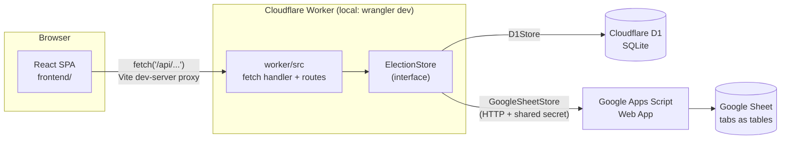

# Technical Specification

Developer-facing reference for the ARP Society Elections system: architecture, folder
structure, every source file's responsibility, data model, API surface, and the security/
business rules baked into the code. For end-user instructions see [README.md](README.md);
for scenario-based Q&A see [docs/VOTER_FAQ.md](docs/VOTER_FAQ.md) and
[docs/ADMIN_FAQ.md](docs/ADMIN_FAQ.md).

## 1. High-level architecture



- **Frontend**: React 18 + TypeScript SPA built with Vite, routed with `react-router-dom`.
  Talks to the backend exclusively through `fetch('/api/...')`.
- **Backend**: a single Cloudflare Worker (plain `fetch` handler, no framework) that
  implements all business logic and routes requests to one of two interchangeable storage
  backends behind a common `ElectionStore` interface.
- **Storage backend #1 — D1**: Cloudflare's SQLite-compatible database. This is the primary,
  most-tested backend; it runs entirely locally via Wrangler's local D1 persistence, so the
  whole system works with **no Cloudflare account**.
- **Storage backend #2 — Google Sheets**: an alternative for societies that would rather keep
  data in a spreadsheet they can see directly. A Google Apps Script Web App
  (`apps-script/Code.gs`) exposes the same operations over HTTP (guarded by a shared secret),
  and the Worker's `GoogleSheetStore` proxies to it. This mirrors `D1Store`'s logic by hand
  because Apps Script cannot import the Worker's TypeScript.
- **No server-side session store**: admin auth is a stateless, HMAC-signed cookie (see
  §6). Voter identity is never stored either — see §5 (anonymity design).

## 2. Repository layout

```
arp-society-elections/
├── worker/                  # Cloudflare Worker: all backend logic and both storage adapters
│   ├── src/
│   │   ├── index.ts         # fetch() entrypoint / top-level route dispatcher
│   │   ├── types.ts         # canonical backend types (Election, Registration, results, Env, …)
│   │   ├── constants.ts     # tunables shared conceptually with apps-script/Code.gs
│   │   ├── security.ts      # credential hashing, admin password check, session tokens
│   │   ├── csv.ts           # CSV parsing/escaping for flat import + audit export
│   │   ├── http.ts          # json()/readJson()/getCookie() helpers
│   │   ├── routes/
│   │   │   ├── voter.ts     # public, unauthenticated endpoints
│   │   │   └── admin.ts     # session-cookie-gated endpoints
│   │   └── store/
│   │       ├── ElectionStore.ts    # the interface both backends implement
│   │       ├── d1Store.ts          # D1 (SQLite) implementation — primary backend
│   │       ├── googleSheetStore.ts # Google Sheets backend (HTTP proxy to Apps Script)
│   │       └── index.ts            # createStore(env) factory
│   ├── scripts/
│   │   └── set-admin-password.mjs  # writes only a password HASH into .dev.vars
│   ├── schema.sql            # D1 schema — single source of truth for the data model
│   ├── wrangler.toml          # Worker config (D1 binding, default vars)
│   ├── .dev.vars / .dev.vars.example  # local secrets (gitignored) / template
│   └── package.json
├── frontend/                 # React + Vite SPA
│   └── src/
│       ├── main.tsx           # ReactDOM root, sets document.title from SITE_TITLE
│       ├── App.tsx             # react-router-dom route table
│       ├── api.ts              # thin fetch wrapper, one function per Worker endpoint
│       ├── types.ts            # hand-kept mirror of worker/src/types.ts response shapes
│       ├── constants.ts        # frontend-only tunables (SITE_TITLE, standard positions, …)
│       ├── styles.css          # "Maplewood" theme + all component styling
│       ├── components/
│       │   └── Countdown.tsx   # live "time remaining" widget used by voter + admin pages
│       └── pages/               # one file per route (see §4 for the full route table)
├── apps-script/
│   ├── Code.gs                # Google Apps Script backend (Google Sheets storage backend)
│   └── README.md               # how to deploy Code.gs as a Web App
├── docs/
│   ├── VOTER_FAQ.md            # end-user FAQ for voters
│   └── ADMIN_FAQ.md            # end-user FAQ for admins
├── README.md                   # end-user setup/usage guide (not technical)
└── technical_spec.md           # this file
```

## 3. Backend (`worker/`) — file-by-file

### `src/index.ts`
The Worker's `fetch()` entrypoint. Dispatches by **path prefix** (not exact match):
- `/api/election/*` or `/api/voter/*` → `handleVoterRequest` (public routes)
- `/api/admin/*` → `handleAdminRequest` (session-gated routes)
- anything else → `404`

Any thrown error is caught and turned into a `500` JSON response so callers always get a
parseable body. **Historical gotcha** (documented in-file): the dispatcher once exact-matched
`/api/election/status` only, so a later route added at `/api/election/results` 404'd until the
match was changed to a prefix check. Any new route under an existing prefix needs no
dispatcher change; a route under a brand-new top-level prefix does.

### `src/types.ts`
Canonical backend type definitions — `Election`, `Position`, `Candidate`, `Registration`,
`FlatStatus`, `BallotSelection`, `Turnout`, `PositionResult`, `DeclaredResults`,
`WinnerConflict`, `PublicResults`, and the Worker's `Env` bindings interface. **Not** imported
by the frontend (separate build target/package) — `frontend/src/types.ts` is a hand-kept
mirror; update both when a shape changes. `ElectionStatus` and `StorageBackend` are derived
from `constants.ts` (`(typeof X)[keyof typeof X]`) rather than hand-written string unions, so
the two can't drift.

### `src/constants.ts`
Single place for backend tunables:
- `STORAGE_BACKENDS` (`D1` / `GOOGLE_SHEET`), `ELECTION_STATUSES` (`draft` / `scheduled` /
  `open` / `closed` / `cancelled`)
- `ADMIN_SESSION_COOKIE_NAME`, `ADMIN_SESSION_TTL_SECONDS` (8 hours)
- `CREDENTIAL_CODE_ALPHABET` (`23456789ABCDEFGHJKMNPQRSTVWXYZ` — no `0/O/1/I`, to avoid
  transcription errors), `CREDENTIAL_CODE_LENGTH` (8), `CREDENTIAL_CODE_GROUP_SIZE` (4, renders
  as e.g. `7K4M-9PQR`)
- `NOTA_CANDIDATE_NAME`, `FLAT_CSV_HEADERS`, `REGISTRATION_KEY_CSV_HEADERS`
- `MIN_POSITIONS_PER_ELECTION`, `MIN_CANDIDATES_PER_POSITION`, `MIN_SEATS_PER_POSITION`

Anything duplicated in `apps-script/Code.gs` (which can't import this file) is flagged in a
comment there too — **the two must be kept in sync by hand.**

### `src/security.ts`
All cryptography, using the Workers-native Web Crypto API (`crypto.subtle`) — no external
dependency:
- `hashCredential(code, pepper)` — HMAC-SHA256(pepper, code). Voting codes and registration
  keys are **never stored in plaintext**, only as this hash.
- `generateCredentialCode()` — 8 random chars from the safe alphabet, grouped as `XXXX-XXXX`.
- `verifyAdminPassword(password, expectedHashHex)` — SHA-256 the input, compare in constant
  time (see `timingSafeEqual`, which deliberately avoids `===` to prevent timing attacks that
  could reveal how many leading characters matched).
- `createAdminSession(secret)` / `verifyAdminSession(secret, token)` — a **stateless** session:
  a base64url JSON payload (`{ exp }`) plus an HMAC signature over that payload, joined with
  `.`. No server-side session table; any request with a validly-signed, unexpired token is
  treated as an authenticated admin.

### `src/csv.ts`
Minimal, purpose-built CSV parsing/escaping (not a general library):
- `parseFlatsCsv(text)` — accepts either a `flat_no` header row or one bare flat number per
  line.
- `csvCell(value)` — quotes/escapes a value only if it contains a comma, quote, or newline.

### `src/http.ts`
Three shared helpers used by both route modules: `json()` (consistent JSON responses),
`readJson<T>()` (throws a user-facing error on malformed bodies), `getCookie()` (cookie
header parsing, used to read the admin session cookie).

### `src/routes/voter.ts` — public endpoints (no auth)
| Method | Path | Purpose |
|---|---|---|
| GET | `/api/election/status` | Current election's name/status/opensAt/closesAt, or `null` |
| GET | `/api/election/results` | Public results (`null` until admin publishes) |
| POST | `/api/voter/register` | Self-service registration (flat no + registration key + name/phone/email) |
| POST | `/api/voter/verify` | Verify a voting code, returns election + positions if valid |
| POST | `/api/voter/ballot` | Cast a ballot for a verified code |

### `src/routes/admin.ts` — session-gated endpoints
Login/logout are the only routes that don't require a session; every other route checks
`verifyAdminSession` first and returns `401` if absent/invalid. One session can do everything
below — there's no finer-grained permission model.

| Method | Path | Purpose |
|---|---|---|
| POST | `/api/admin/login` | Verify password, set `HttpOnly` session cookie |
| POST | `/api/admin/logout` | Clear the session cookie |
| GET | `/api/admin/me` | Session check (used by the dashboard on load) |
| GET | `/api/admin/election` | Current election + turnout + active backend name |
| POST | `/api/admin/election` | Create a new election (name + positions) |
| POST | `/api/admin/election/schedule` | Set `opensAt`/optional `closesAt` |
| POST | `/api/admin/election/status` | Manual transition: `open` / `closed` / `cancelled` |
| POST | `/api/admin/flats` | Import eligible flat numbers (CSV text); returns a downloadable registration-keys CSV |
| GET | `/api/admin/registrations` | List every eligible flat + its current registration (if any) |
| POST | `/api/admin/registrations` | Admin-assisted registration (no registration key needed) |
| POST | `/api/admin/registrations/revoke` | Revoke a registration (blocked if already voted) |
| GET | `/api/admin/turnout` | `{ totalFlats, registeredCount, votedCount }` |
| GET | `/api/admin/results` | Raw per-candidate vote counts (admin-only) |
| GET | `/api/admin/declared-results` | Winners/vacancies/conflicts computed from raw results |
| POST | `/api/admin/declared-results/decline` | Decline a candidacy (winner-conflict resolution) |
| POST | `/api/admin/declared-results/clear` | Clear all decline decisions, recompute from raw counts |
| POST | `/api/admin/results/publish` | Make results visible to voters (blocked while conflicts remain) |
| GET | `/api/admin/export` | Download full audit CSV (attendance + raw results + declared winners) |

### `src/store/ElectionStore.ts`
The interface both `D1Store` and `GoogleSheetStore` implement identically (and that
`apps-script/Code.gs`'s action router mirrors by hand), so no other part of the app ever
branches on which backend is active. Exports `StoreError` — thrown for expected, user-facing
failures (bad input, wrong election state, etc.); routes catch it and turn it into a `400`,
letting any other exception type fall through as a `500`.

Key methods and their contracts (see inline JSDoc in the file for the full list):
- `getElection()` — always the single most-recently-created election, or `null`.
- `createElection()` — fails if a draft/scheduled/open election already exists (only one
  election "in flight" at a time; closed/cancelled elections don't block a new one).
- `scheduleElection()` — moves `draft`→`scheduled`. The actual `open`/`closed` transition
  happens **lazily**, the next time `getElection()` runs past the target time (no cron/alarm).
- `importFlats()` / `registerVoter()` / `adminRegisterVoter()` / `listRegistrations()` /
  `revokeRegistration()` — the self-service registration model (see §5).
- `castBallot()` — atomic; rejects a second call for the same credential.
- `getResults()` vs `getDeclaredResults()` vs `getPublicResults()` — three different views of
  the same vote counts, deliberately kept distinct (raw counts / admin-only winners+conflicts /
  voter-facing, publish-gated). See §7 for why.

### `src/store/d1Store.ts` — primary backend (SQLite via D1)
The most heavily tested implementation. Notable internals:
- `applyScheduledTransition()` — called at the top of every `getElection()`; flips
  `scheduled`→`open`→`closed` once the wall clock passes `opens_at`/`closes_at`, persisting the
  change. This is what makes scheduling work without a cron trigger.
- `createRegistration()` (private, shared by `registerVoter`/`adminRegisterVoter`) — validates
  name/phone/email are all present, checks for an existing active registration on the flat,
  and if the `INSERT` fails on the partial unique index (see schema below), returns the same
  friendly "already registered" error — this closes a check-then-act race condition where two
  people submit for the same flat at nearly the same instant.
- `revokeRegistration()` — **throws if `has_voted = 1`**. This is the critical integrity
  safeguard: without it, revoke-then-reregister would let a flat vote twice.
- `castBallot()` — the "atomic guard" is a single `UPDATE ... WHERE has_voted = 0 AND
  revoked_at IS NULL`; only if that update actually changes a row does the code proceed to
  insert ballots. This makes concurrent double-submits for the same code, or a vote racing a
  revoke, mutually exclusive at the database level rather than relying on an app-level check
  then a separate write.
- `validateSelections()` and `buildDeclaredResults()` are exported as free functions (not
  methods) specifically so their logic can be described once here and reasoned about
  independently of storage — and so the Google Apps Script mirror can replicate the exact same
  rules by hand.
- `exportAudit()` produces a single CSV with three sections (`attendance`, `results`,
  `declared`) plus a trailing `unresolved_conflict` note section if applicable.

### `src/store/googleSheetStore.ts` — Google Sheets backend
A thin HTTP client: every `ElectionStore` method becomes `this.call('methodName', payload)`,
which `POST`s `{ secret, action, payload }` to the Apps Script Web App URL (`GAS_URL`) and
unwraps `{ ok, result }` / `{ ok: false, error }`. All actual logic lives in
`apps-script/Code.gs` (see §3.1). Not independently end-to-end tested against a live Google
account as part of this project's development — only verified by code review against
`d1Store.ts`'s behavior.

### `src/store/index.ts`
`createStore(env)` — reads `env.STORAGE_BACKEND` and constructs the matching implementation.
Chosen once per request; the two backends are never mixed at runtime.

### `scripts/set-admin-password.mjs`
A small Node script that hashes a password (SHA-256) and writes **only the hash** into
`.dev.vars`'s `ADMIN_PASSWORD_HASH`. Exists specifically so the admin password itself never
needs to be typed into any file that could be committed — see §6 for the reasoning.

### `schema.sql` — D1 data model
```
elections            (id, name, status, backend, created_at,
                       opens_at, closes_at, opened_at, closed_at, results_published_at)
positions             (id, election_id, title, seats, sort_order)
candidates            (id, election_id, position_id, name, is_nota, sort_order)
flats                 (id, election_id, flat_no, registration_key_hash, created_at)
registrations         (id, election_id, flat_id, voter_name, voter_phone, voter_email,
                        credential_hash, has_voted, voted_at, registered_at, revoked_at)
ballots               (id, election_id, position_id, candidate_id, cast_at)
declined_candidacies  (id, election_id, position_id, candidate_id, declined_at)
```
Two constraints enforced **at the database level**, not just in application code:
- `UNIQUE INDEX idx_registrations_active_per_flat ON registrations(flat_id) WHERE revoked_at
  IS NULL` — a partial/filtered unique index, so a flat can accumulate revoked history rows but
  can only ever have **one active** registration at a time.
- `ballots` carries **no column referencing a voter or registration** — by design (see §5).

`registrations.revoked_at` is a **soft delete**: revoking never removes the row (keeps audit
history), it just invalidates the credential and, combined with the partial unique index above,
frees the flat number up to be re-registered.

## 4. Frontend (`frontend/`) — file-by-file

### Routing (`src/App.tsx`)
| Route | Page | Auth | Purpose |
|---|---|---|---|
| `/` | `VoterLoginPage` | none | Entry point; shows live countdown if scheduled, code entry once open |
| `/register` | `RegisterPage` | none | Self-service registration (flat no + registration key) |
| `/vote` | `VoterBallotPage` | code (via router state) | Ballot form; bounces to `/` if no state (e.g. direct nav/refresh) |
| `/receipt` | `VoterReceiptPage` | code (via router state) | Post-vote confirmation — deliberately shows no candidate choice |
| `/results` | `ResultsPage` | none | Public results, only populated after admin publishes |
| `/admin` | `AdminLoginPage` | none | Admin password sign-in |
| `/admin/dashboard` | `AdminDashboardPage` | session cookie | Current election's status only; redirects to setup if none |
| `/admin/setup-election` | `AdminSetupElectionPage` | session cookie | One-time election-creation wizard |

There is deliberately **no global client-side store**: voter-flow state (code, election
positions, ballot receipt) is passed page-to-page via `react-router-dom`'s `location.state`,
not persisted anywhere — see each page's `location.state` read. There is also **no 404/
catch-all route** (known gap; not yet requested).

### `src/main.tsx`
React root + sets `document.title = SITE_TITLE` before rendering, so the browser tab title and
the on-page `<h1>` (in `VoterLoginPage`) always agree without editing `index.html`.

### `src/api.ts`
One function per Worker endpoint (`getElectionPublicStatus`, `verifyVoterCode`, `castBallot`,
`adminLogin`, `adminLogout`, `getAdminElection`, `createElection`, `scheduleElection`,
`setElectionStatus`, `importFlats`, `listRegistrations`, `adminRegisterVoter`,
`revokeRegistration`, `registerVoter`, `getResults`, `getDeclaredResults`, `declineCandidacy`,
`clearDeclines`, `publishResults`, `getPublicResults`). All go through a shared `request<T>()`
helper that throws with the server's human-readable `reason`/`error` message on failure, so
every call site needs only a single `try/catch`.

### `src/types.ts`
Hand-kept mirror of `worker/src/types.ts`'s response shapes — frontend and worker are separate
build targets/packages and cannot literally share one file. **Must be updated in lockstep**
whenever a worker response shape changes.

### `src/constants.ts`
- `SITE_TITLE` — shown as the voter page `<h1>` and the browser tab title.
- `STANDARD_POSITIONS` — the 7 default society position titles offered by the "Use standard
  society positions" button on the setup page.
- `MIN_SEATS_PER_POSITION` / `MAX_SEATS_PER_POSITION` (1 / 5).
- `FLAT_CSV_HEADERS` / `FLAT_CSV_TEMPLATE` — mirrors the worker's CSV column naming.

### `src/components/Countdown.tsx`
Reusable "time remaining until target" ticker (updates every second via `setInterval`), used
by both `VoterLoginPage` (voting-opens countdown) and `AdminDashboardPage` (voting-opens and
voting-closes countdowns). Calls `onReached()` exactly once when it crosses zero, which the
dashboard uses to trigger a data refresh right as a scheduled transition should occur.

### `src/pages/VoterLoginPage.tsx` (`/`)
Fetches public election status. Shows "No election is currently set up" if none exists, a live
countdown if `scheduled`, or a code-entry form if `open`. On successful `verifyVoterCode()`,
navigates to `/vote` carrying `{ code, electionName, positions }` in router state. Shows a
"Register your flat" link to `/register` while status is `draft`/`scheduled`/`open`.

### `src/pages/RegisterPage.tsx` (`/register`)
Self-service registration form: flat number, registration key, name, phone, email (all
required; email is `type="email"`). On success, shows the generated voting code **once** with
a "Continue to vote now" button that calls `verifyVoterCode()` again and navigates straight to
`/vote` — sparing the voter from re-typing the code they were just shown.

### `src/pages/VoterBallotPage.tsx` (`/vote`)
Reads `{ code, electionName, positions }` from router state (redirects to `/` if absent —
handles direct navigation/refresh, which has no state to work with). Renders each position as
radio buttons (single-seat) or capped checkboxes (multi-seat, disabled once the seat cap is
reached). On submit, calls `castBallot()` and navigates to `/receipt` with the returned ballot
IDs and timestamp.

### `src/pages/VoterReceiptPage.tsx` (`/receipt`)
Shows only a receipt/ballot ID and timestamp — **never** the candidate choice, which is what
keeps the receipt from doubling as proof of how someone voted (a coercion/vote-buying defense).

### `src/pages/ResultsPage.tsx` (`/results`)
Public, unauthenticated. Three states: `undefined` → "Loading…"; `null` → "Results have not
been published yet"; populated → full per-position table with 🏆 winner markers and turnout.
Mirrors the admin results table but omits all winner-resolution controls.

### `src/pages/AdminLoginPage.tsx` (`/admin`)
Password form; on success the server sets an `HttpOnly` cookie and this page just navigates to
`/admin/dashboard` — it holds no session state itself.

### `src/pages/AdminSetupElectionPage.tsx` (`/admin/setup-election`)
Standalone election-creation wizard (extracted out of the dashboard so that page could be
purely status-driven — see the file's header comment). Builds a list of `{ title, seats,
candidateNames[] }` position drafts client-side (`Use standard society positions` button, add/
remove position, add/remove candidate), then `POST`s the whole thing in one `createElection()`
call. On success, navigates to `/admin/dashboard`.

### `src/pages/AdminDashboardPage.tsx` (`/admin/dashboard`)
The largest frontend file. Fetches the current election on mount; if none exists, **redirects**
to `/admin/setup-election`. Otherwise renders exactly one panel based on `election.status`,
so the file reads top-to-bottom as the election lifecycle itself:

- **`DraftOrScheduledPanel`** (`draft`/`scheduled`) — embeds `RegistrationsPanel`; scheduling
  form (`opensAt`/optional `closesAt`); "Open voting now" (disabled until at least one
  registration exists); `CancelElectionButton`.
- **`OpenElectionPanel`** (`open`) — live turnout, "Close voting", `CancelElectionButton`, and
  still embeds `RegistrationsPanel` (late registration is allowed while voting is open).
- **`ClosedElectionPanel`** (`closed`/`cancelled`) — raw results table with 🏆 winner markers,
  embeds `WinnerResolutionPanel` when conflicts exist, a "Publish results to voters" button
  (disabled while unresolved conflicts remain), an audit CSV download link, and — once the
  election is closed/cancelled — a `Link` to `/admin/setup-election` to start the next one.
- **`RegistrationsPanel`** (shared by draft/open panels) — flat-number import form (returns a
  downloadable registration-keys CSV), a live table of every eligible flat and its registration
  status with a "Revoke" button (disabled once `hasVoted`, with a tooltip explaining why), and
  an admin-assisted "register on their behalf" mini-form.
- **`WinnerResolutionPanel`** — for each name that tops the vote count in 2+ positions, lets the
  admin pick which position they keep; declining the others calls `declineCandidacy()` (which
  recomputes the runner-up for that position server-side). Includes a "reset" action
  (`clearDeclines()`) guarded by a confirm dialog.
- **`CancelElectionButton`** — confirm-gated call to `setElectionStatus('cancelled')`.

### `src/styles.css` — "Maplewood" theme
Warm amber/caramel/walnut-brown palette on a parchment background, defined via CSS custom
properties, applied consistently across every page. Notable non-obvious rules (kept as comments
in the file):
- `button.danger:disabled` is declared **after** `.danger` specifically because two rules of
  equal specificity resolve by source order — without this, a disabled danger button (e.g.
  "Revoke" post-vote) wouldn't visually look disabled even though it's functionally blocked.
- `.candidate-row input` / `.candidate-row .icon-button` both set an explicit matching
  `height`/`box-sizing` so the remove-candidate (`✕`) button lines up exactly with its input,
  which plain `align-items: center` alone didn't achieve (their default paddings produced
  different computed heights).
- `.position-actions` (`justify-content: flex-end`) and `.candidates-header`
  (`justify-content: space-between`) separate the "add candidate" control (kept next to the
  "Candidates" hint, at the top of each position block) from the "remove position" control
  (kept at the bottom, right-aligned) so the two visually distinct destructive/constructive
  actions are never adjacent.

## 5. Anonymity & self-service registration design

The core privacy guarantee: **a ballot never carries any reference back to who cast it.**
- `ballots` rows store only `election_id, position_id, candidate_id, cast_at` — no voter or
  registration ID, by design (see the schema comment).
- Voting is gated by a one-time **credential (voting code)**, itself never stored in plaintext
  — only `hashCredential()`'s HMAC output is persisted (`registrations.credential_hash`).
- `verifyCredential()` and `castBallot()` both look the credential up **by its hash**; once
  `castBallot()` succeeds it flips `has_voted = 1` on the *registration* row (identity), but the
  *ballot* row it inserts has no link back to that registration.

Registration model (self-service, not admin-CSV-driven):
1. Admin imports eligible **flat numbers** only (`importFlats`) — this generates a unique,
   secret **registration key** per flat (also only stored hashed) and returns a CSV the admin
   distributes to each flat (e.g. slipped under the door, not emailed to one specific person).
2. Anyone from that household visits `/register`, supplies the flat number + that key + their
   own name/phone/email, and receives a one-time voting **code** (different secret from the
   registration key) — shown once, not emailed.
3. The registration key requirement exists specifically so self-service registration with
   *just* a flat number isn't possible — otherwise anyone could claim any (possibly guessed)
   flat number, a broken-access-control risk that was caught and fixed proactively during
   development.
4. One **active** registration per flat is enforced by the database (partial unique index), not
   just application logic — closing a check-then-act race.
5. If a registration was made in error, the admin can `revokeRegistration()` — but **only**
   before that registration has voted (`has_voted = 1` hard-blocks revoke server-side), because
   allowing revoke-after-vote would let a flat vote twice under a second identity.

## 6. Admin authentication

- The password itself is never stored — only `ADMIN_PASSWORD_HASH` (its SHA-256) lives in
  `.dev.vars` (gitignored). It's set via `npm run set-admin-password -- "..."`
  (`worker/scripts/set-admin-password.mjs`), which writes only the resulting hash to disk.
  **A request to hardcode the plaintext password into a committed constants file was
  deliberately declined** during development for this reason (OWASP hardcoded-credentials
  risk) — this is a standing constraint, not just a one-off decision.
- Session tokens are **stateless**: `base64url({exp}) + "." + HMAC-SHA256(ADMIN_SESSION_SECRET,
  that base64url string)`. `verifyAdminSession()` checks the signature (constant-time compare)
  and that `exp` hasn't passed. No session table to clean up, but also no server-side way to
  revoke a single outstanding token early (logout just clears the cookie client-side).
- Session cookie: `HttpOnly; Path=/; SameSite=Lax` (+ `Secure` automatically when served over
  `https:`), `ADMIN_SESSION_TTL_SECONDS` = 8 hours.

## 7. Results model: three distinct views, on purpose

| Method | Who sees it | When available | Content |
|---|---|---|---|
| `getResults()` | Admin only | Once closed/cancelled | Raw per-candidate vote counts, no interpretation |
| `getDeclaredResults()` | Admin only | Once closed/cancelled | Raw counts **plus** computed winners per seat, vacant-seat counts, and cross-position name conflicts |
| `getPublicResults()` | Everyone (`/results`) | Only after `publishResults()` is called | Declared winners + turnout — **never available before the admin explicitly publishes** |

`buildDeclaredResults()` (in `d1Store.ts`, mirrored in `Code.gs`) computes winners by taking the
top-`seats` non-NOTA, non-declined candidates per position by vote count, then separately scans
for the same (trimmed, lowercased) name topping the count in **more than one** position — a
"winner conflict" that needs human resolution (someone can't serve two positions at once).
Matching is by name string only, since there's no canonical candidate identity shared across
positions — a documented limitation (two unrelated same-named candidates would falsely
conflict; admin is expected to sanity-check).

`publishResults()` is a hard gate: it refuses to run while `declared.conflicts.length > 0`, so
voters can never see an ambiguous/unresolved result set.

## 8. Local development

### Prerequisites
- Node.js (portable install acceptable — no system install required). Must be on `PATH` for
  each new terminal session.
- No Cloudflare account needed for local dev — Wrangler persists D1 state under
  `worker/.wrangler/state/v3/d1`.

### First-time setup
```powershell
cd worker
npm install
cp .dev.vars.example .dev.vars     # then fill in real values, see below
npm run set-admin-password -- "your-demo-password"   # writes ADMIN_PASSWORD_HASH only
npm run db:init                     # applies schema.sql to the local D1 database

cd ../frontend
npm install
```
`.dev.vars` required values: `STORAGE_BACKEND` (`D1` or `GOOGLE_SHEET`),
`ADMIN_PASSWORD_HASH` (via the script above, never typed by hand), `ADMIN_SESSION_SECRET`
(any long random string), `CREDENTIAL_PEPPER` (a different long random string). Only needed for
`GOOGLE_SHEET`: `GAS_URL`, `GAS_SHARED_SECRET` (see `apps-script/README.md`).

### Running
```powershell
# Terminal 1 — Worker (http://127.0.0.1:8787)
cd worker; npm run dev

# Terminal 2 — Frontend (http://localhost:5173)
cd frontend; npm run dev
```
Vite's dev server (`frontend/vite.config.ts`) proxies `/api/*` to `http://127.0.0.1:8787`, so
the browser only ever talks to one origin (`localhost:5173`) during local development.

### Build / typecheck
```powershell
cd frontend; npm run build     # tsc -b && vite build
cd worker; npm run typecheck   # tsc --noEmit
```

### Resetting local data
Re-run `npm run db:init` in `worker/` after deleting `worker/.wrangler/state/v3/d1` (or just
re-running the schema, which uses `CREATE TABLE IF NOT EXISTS` so it's safe to re-apply, though
it won't drop existing tables/data on its own).

## 9. Google Sheets backend (`apps-script/`)

`Code.gs` is a **hand-written mirror** of `d1Store.ts`'s logic against a Google Sheet used as a
set of tables (one sheet tab per SQL table: `Elections`, `Positions`, `Candidates`, `Flats`,
`Registrations`, `Ballots`, `DeclinedCandidacies`). Key differences from D1:
- `LockService` is used to get the same atomicity guarantees D1 gets for free from SQL
  constraints and atomic `UPDATE ... WHERE` clauses (e.g. guarding registration and vote-casting
  against concurrent duplicate requests).
- Every request must include a shared secret (`PropertiesService.getScriptProperties()
  .getProperty('SHARED_SECRET')`) matched against the Worker's `GAS_SHARED_SECRET`, since a
  deployed Web App URL is otherwise unauthenticated.
- Constants that logically belong in `worker/src/constants.ts` (`CODE_ALPHABET`, code length/
  grouping, `NOTA_CANDIDATE_NAME`) are hand-copied at the top of the file with a comment noting
  they must be kept in sync manually.
- **Not independently end-to-end tested** as part of this project (would require deploying to
  a real Google account) — verified only by code review against `d1Store.ts`.

See `apps-script/README.md` for deployment steps (Apps Script project, Web App deployment,
script properties, spreadsheet tab setup).

## 10. Known gaps / deliberately deferred work

- No 404/catch-all route in `frontend/src/App.tsx`.
- No actual email delivery of voting codes/registration keys (the flows generate them and
  display/download them, but sending isn't wired up — would need `MailApp` for the Apps Script
  backend or a third-party API like Resend/SendGrid for the Worker/D1 backend).
- Google Sheets backend is implemented but not independently live-tested end-to-end.
- Winner-conflict matching by name string only (no canonical cross-position candidate
  identity) — documented limitation, not a bug.
- No server-side ability to revoke a single admin session early (stateless tokens only expire
  by TTL or client-side cookie clear).
